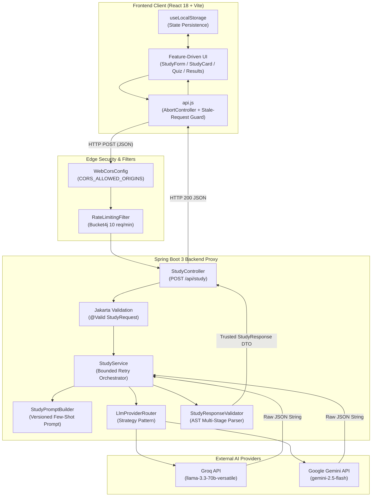
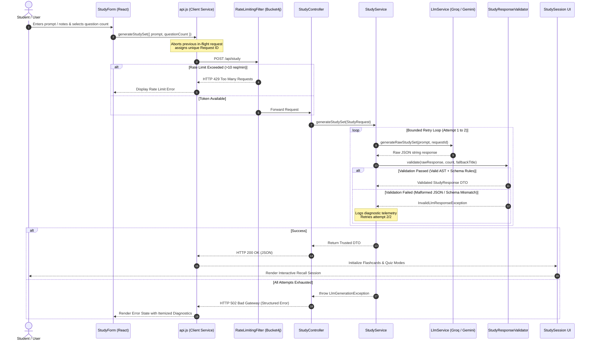
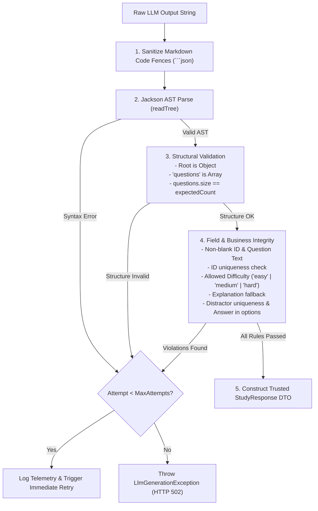
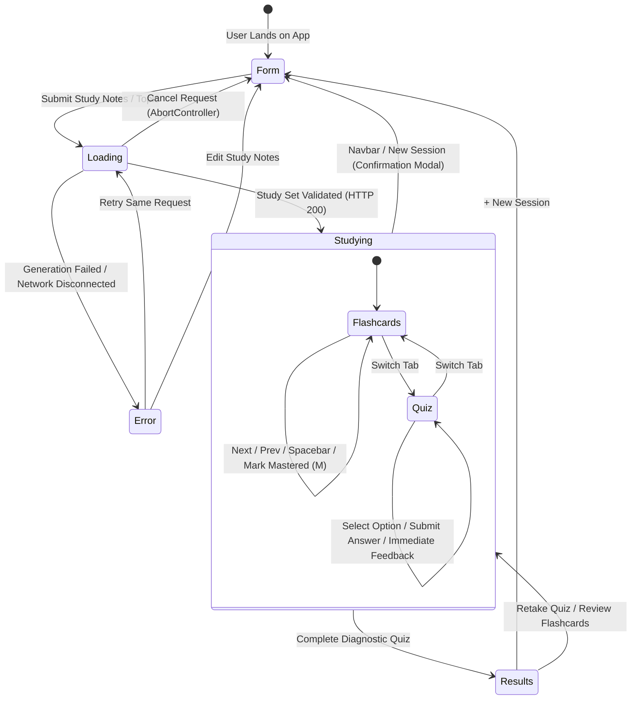

# AI Study Assistant

A full-stack AI Study Assistant built for the Flam Software Engineering Internship assignment that transforms unstructured study notes, lecture excerpts, and custom topics into interactive learning experiences (Active Recall Flashcards and Diagnostic Assessment Quizzes).

Built with **React 18 (Feature-Driven Architecture) + Tailwind CSS** on the frontend and **Java 17 / Spring Boot 3** on the backend.

---

## 🎯 Assignment & Problem Statement

This project fulfills the **Study Assistant** assignment specifications:
- **Unified Free-form Text Input**: Takes arbitrary study notes, lecture excerpts, topic prompts, or questions (e.g. *"Explain Java HashMap collision handling"*, *"Photosynthesis overview"*, *"How to cook Maggi"*).
- **Not a Chatbot**: Converts raw LLM output into structured, validated JSON data rendered as interactive components (Flashcards with progressive sleeve reveal, multi-choice diagnostic quizzes with instant feedback, and score reviews).
- **Backend API Proxy**: API keys (Groq, Gemini) are strictly stored on the backend and never exposed to the client.
- **Resilient AI Failure Handling**: Comprehensive multi-stage validation, bounded retry, and stale request cancellation.
- **Apple Dark Minimalist UX**: SF Pro typography, squircle containers, translucent glass navigation, and keyboard shortcuts (`Space`, `Arrows`, `M`).

---

## 🏗 System Architecture



---

## 🔄 User Request & End-to-End Processing Flow



---

## 🛡 Handling Bad AI Output & Resilience Pipeline

Handling model unreliability is central to this application:



### Resilience Guarantees:
1. **Multi-Stage Deterministic Validation (`StudyResponseValidator.java`)**:
   - **JSON Syntactic Check**: Parses JSON AST, handles markdown code-fence encapsulation (` ```json `), and extracts the JSON object from surrounding text. Invalid JSON is rejected and retried rather than silently accepted.
   - **Schema & Field Integrity**: Verifies question array bounds ($3 \le count \le 10$), required fields (`id`, `question`, `answer`, `difficulty`, `options`).
   - **Duplicate Detection**: Enforces uniqueness across questions.
   - **Options Consistency**: Ensures multiple-choice options contain the correct answer and unique distractors.
2. **Bounded Automatic Retry (`StudyService.java`)**:
   - If the LLM generates invalid JSON or fails schema validation, the backend logs diagnostic telemetry and performs a bounded retry before failing gracefully.
3. **Stale Response Protection (`api.js`)**:
   - Uses `AbortController` and an incremental request sequence tracker. If a user triggers a new generation or cancels while a previous LLM request is in flight, the older response is aborted and prevented from overwriting newer state.
4. **Token Bucket Rate Limiting (`RateLimitingFilter.java`)**:
   - In-memory Bucket4j IP rate limiter enforcing 10 generation requests per minute per client IP. Emits standard `X-Rate-Limit-Remaining` and `Retry-After` headers.

---

## ⚠️ Known Limitations

- Generated study content can contain factual inaccuracies because it depends on the selected LLM.
- The backend validates JSON structure and application-level rules but does not guarantee factual correctness.
- Study sessions are stored locally in the browser and are not synchronized across devices.
- The current application uses a fixed question schema rather than arbitrary AI-generated content blocks.
- Rate limiting is in-memory and intended as lightweight protection rather than distributed production infrastructure.

---

## 📱 Frontend Feature-Driven Navigation & State



---

## 📂 Project Structure

```
Flam/
├── backend/                              # Spring Boot 3 Backend
│   ├── src/main/java/com/studyassistant/
│   │   ├── config/                       # CORS & Rate Limit configurations
│   │   ├── constant/                     # Centralized constants (zero magic strings)
│   │   ├── controller/                   # REST API controllers (/api/study, /api/health)
│   │   ├── dto/                          # Immutable Records (StudyRequest, StudyResponse, Question)
│   │   ├── exception/                    # Custom exceptions & GlobalExceptionHandler
│   │   ├── filter/                       # Bucket4j Rate Limiting Filter
│   │   ├── prompt/                       # Versioned Few-shot prompt builder
│   │   ├── service/                      # StudyService orchestrator
│   │   │   ├── llm/                      # Strategy Pattern (Gemini, Groq, Router)
│   │   │   └── ratelimit/                # Token bucket service
│   │   └── validation/                   # Multi-stage deterministic JSON validator
│   └── src/test/java/                    # Unit & Integration Tests (100% Pass)
│
├── frontend/                             # React 18 + Vite Frontend
│   └── src/
│       ├── components/common/            # Navbar, ConfirmationDialog, LoadingState, ErrorState, ProgressIndicator
│       ├── constants/                    # Centralized routes, limits, storage keys
│       ├── features/                     # Feature-Driven Architecture
│       │   ├── prompt-entry/             # StudyForm & Presets
│       │   ├── flashcards/               # Active Recall Cards & Keyboard Shortcuts
│       │   ├── quiz/                     # Diagnostic assessment & feedback
│       │   ├── study-session/            # Session orchestration & Tab switcher
│       │   └── results/                  # Radial Mastery Gauge & Diagnostic breakdown
│       ├── hooks/                        # useLocalStorage, useKeyboardShortcuts
│       └── services/                     # api.js (Fetch, AbortController, Stale Request Guard)
```

---

## 🚀 Quick Start & Running Locally

### Prerequisites
- **Java 17+** (`java -version`)
- **Node.js 18+** & **npm**

### 1. Configure & Run Backend (Port 8081)

Create a `.env` file in the project root (or copy `.env.example`):
```env
LLM_PROVIDER=gemini
LLM_API_KEY=your_api_key_here
```

Run the backend server:
```bash
cd backend
./gradlew bootRun
```

### 2. Run Frontend (Port 5173)

```bash
cd frontend
npm install
npm run dev
```

Open `http://localhost:5173` in your browser.

---

## 🧪 Running Automated Tests

```bash
cd backend
./gradlew test
```

---

## 🤖 AI Usage Note

In accordance with the assignment guidelines:
- **Tools Used**: Antigravity / Gemini for rapid architecture scaffolding, Spring Boot configuration, and UI iteration.
- **Engineering Decisions**:
  - Structured prompt design with few-shot JSON formatting constraints (`study-v1`).
  - Strategy + Template Method pattern for LLM clients (`AbstractHttpLlmClient.java`).
  - Separation of UI state between Flashcard and Quiz modes with synchronized index and persistent quiz results.
  - Bucket4j Token Bucket rate limiter to protect backend against scrapers and credit exhaustion.

---

## ⏱ Time Spent

- **Architecture & Backend Pipeline**: ~2.5 hours (Spring Boot 3, LLM providers, multi-stage validator, tests).
- **Frontend Core & State Synchronization**: ~2.5 hours (React components, state synchronization, stale request protection).
- **Design System, Dark Theme & Polish**: ~2.0 hours (Tailwind CSS, animations, responsive design, keyboard navigation).
- **Testing & Documentation**: ~0.5 hours.
- **Total Time**: ~7.5 hours (within the 8-hour target).
